# Linux Network Internals

# Part 1: general background

## Chapter 1: introduction

### Basic terminology

* _Byte_ over _octet_
* _ingress_ or input, __Rx__
* _egress_ or output, __Tx__

### Common coding patterns

Some requirements are common to several kernel components:
* allocate several instances of the same data structure type
* need to keep track of references to an instance of a data
  structure to avoid unsafe memory deallocations

#### Memory caches

* `kmalloc()` or `kfree()`
* use alloc/dealloc routine with dedicated cache

1. _Socket buffer descriptors_: cache allocated by `skb_init()` in `net/core/sk_buff.c` and used for the allocation of `sk_buff` buffer descriptors.
2. _neighbouring protocol mappings_
3. _routing tables_: two memory caches

some kernel functions:
* `kmem_cache_create`
* `kmem_cache_destroy`
* `kmem_cache_alloc`
* `kmem_cache_free`

#### Caching and hash tables

common caches for l3-to-l2 mapping. often implemented with hash tables.

#### Reference counts

pseudo-gc and calling functions (`xxx_hold` or `xxx_release/put`)

#### Garbage collection

* __asynchronous:__ timer trigger routine to inspect a set of data structures (eligible for deletion)
* __synchronous:__ do not wait for timer

#### Functions pointers and virtual function tables (VFTs)

interfaces between kernel components or generic mechanisms to invoke the right function handler.

* _virtual function table_ (VTF): set of function pointers grouped into a DS. Can be used as an interface between two major subsystems (L3 and L4)

#### goto statements

#### Vector definitions

```c
struct abc {
  int age;
  char *name[20]
  ...
  char placeholder[0];
}
```

Here, `placeholder` either points to the end of the structure or reuse the same definition in different structures by extending it and modifying it slightly.

#### Conditional directive (#ifdef and family)

Mostly used to check if a given feature is supported by the kernel.

#### Compile-time optimization for condtion checks

`likely` and `unlikely` macros.

#### Mutual Exclusion

* Spin locks
* Read-write locks
* Read-copy-update (RCU)

#### Conversions between host and network order

Endianness... 

* `htons`: host-to-network order (short)
* `htonl`: host-to-network order (long)
* `ntohs`: network-to-host (short)
* `ntohl`: network-to-host (long)

#### Catching bugs (?)

* `BUG_ON`
* `BUG_TRAP`

#### Measuring time

__tick:__ time between two consecutives expirations of the timer interrupt, which expires in HZ times per second. For example, if `HZ` = 1,000, then the timer interrupt expires 1,000 times per second (or 1 ms between two consecutive expirations).

Every time the timer expires, `jiffies++`. This variable represents the number of ticks since the system booted and thus can be used to measure the passing of time.

## Chapter 2: critical data structure

* `struct sk_buff`: where a packet is stored. Used by all layers to store their headers, payload and other stuff.
* `struct net_device`: represents the network device (HW and SW configuration).
* `struct sock`: not covered here...

### The socket buffer

"*it consists of a tremendous heap of variables that try to be all things to all people*"

Fields classification:
- layout
- general
- feature-specific
- management functions

Each layer appends its header on the struct via the `skb_reserve` function to reserve space for its header. When the buffer is passed up the layers, the useless headers are not removed but the pointer to payload moved (less CPU cycle)

#### Networking options and kernel structures

`sk_buff` is peppered with C preprocessor directives to accomodate many options.

#### Layout fields

Exist to facilitate searching and to organize the DS itself. Pseudo doubly-linked list of all `sk_buff` struct.

```c
struct sk_buff_head {
  struct sk_buff *next;
  struct sk_buff *prev;
  __32 qlen;
  spinlock_t lock;
}
```

where `qlen` represents the number of elements in the list; `lock` is to prevent simultaneous accesses. Every `sk_buff` structure contains a poitner to the single `sk_buff_head`: `list`

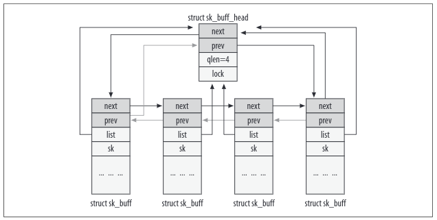

* `struct sock *sk`: pointer to the buffer that owns this buffer.
* `unsigned int len`: size of block of data in buffer (includes data in the main buffer and in the fragments). Its value will change as the buffer moves between the layers.
* `unsigned int data_len`: size of data in fragments
* `unsigned int mac_len`: size of MAC header
* `atomic_t users`: reference count.
* `unsigned int truesize`: total size of the buffer, include the `sk_buff` itself. Set by `allock_skb` to *len + sizeof(sk_buff)*
  
Represent boundaries of buffer and data within it:
* `unsigned char *head`: start buffer
* `unsigned char *end`: end buffer
* `unsigned char *data`: start data
* `unsigned char *tail`: end data
Manipulated when a layer prepares its activities. Layers can fill the gap between `head` and `data` with a protocol header, or the gap between `tail` and `end` with new data.

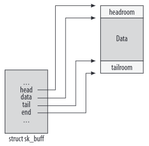

* `void (*destructor)(...)`: function pointer can be initialized to a routine that performs some activity when the buffer is removed. When the buffer belongs to a socket, it is usually set to `sock_rfree` or `sock_wfree` (by `skb_set_owner_r` and `skb_set_owner_w`).

#### General fieds

* `struct timeval stamp`: timestamp for when a packet was received. Set by the function `netif_rx` with `net_timestamp`, which is called by the device driver after the reception.
* `struct net_device *dev`: the network device.
* `struct net_device *input_dev`: device the sent the packet
* `struct net_device *real_dev`: virtual devices only
* 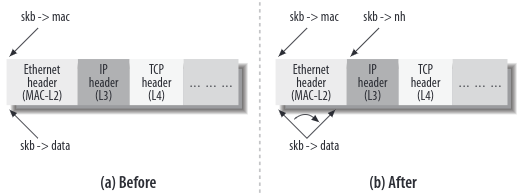
* `struct dst_entry dst`: used by routing subsystem...
* `char cb[40]`: control buffer used to store layer-specific control information. 
* `unsigned int csum` and `unsigned char ip_summed`: checksum and associated status flag.
* `unsigned char cloned`: boolean flag to indicate whether this structure is a clone
* `unsigned char pkt_type`: classify the type of frame...
* `__u32 priority`: QoS class of a packet.
* `unsgined short protocol`: protocol used at the next-higher layer (typically IP, IPv6 or ARP). Used to select which handler to use.
* `unsigned short security`: security level of the packet - no longer used...

#### Feature-specific fields

Fields compiled only if some features are enabled

#### Management functions

Functions to manipulate `sk_buff` elements or list of elements.
These can exists in two version `do_something` and `__do_something`, the first one being a wrapper to the second that adds either sanity checks or locking mechanisms.

__Allocating memory: `alloc_skb` and `dev_alloc_skb`__

Creating a single buffer = 2 allocations (buffer and head structure)

```c
struct sk_buff *__alloc_skb(unsigned int size, gfp_t gfp_mask,
			    int flags, int node)
{
	struct kmem_cache *cache;
	struct sk_buff *skb;
	u8 *data;
	bool pfmemalloc;

	cache = (flags & SKB_ALLOC_FCLONE)
		? skbuff_fclone_cache : skbuff_head_cache;

	if (sk_memalloc_socks() && (flags & SKB_ALLOC_RX))
		gfp_mask |= __GFP_MEMALLOC;

	/* Get the HEAD */
	if ((flags & (SKB_ALLOC_FCLONE | SKB_ALLOC_NAPI)) == SKB_ALLOC_NAPI &&
	    likely(node == NUMA_NO_NODE || node == numa_mem_id()))
		skb = napi_skb_cache_get();
	else
		skb = kmem_cache_alloc_node(cache, gfp_mask & ~GFP_DMA, node);
	if (unlikely(!skb))
		return NULL;
	prefetchw(skb);

	/* We do our best to align skb_shared_info on a separate cache
	 * line. It usually works because kmalloc(X > SMP_CACHE_BYTES) gives
	 * aligned memory blocks, unless SLUB/SLAB debug is enabled.
	 * Both skb->head and skb_shared_info are cache line aligned.
	 */
	size = SKB_DATA_ALIGN(size);
	size += SKB_DATA_ALIGN(sizeof(struct skb_shared_info));
	data = kmalloc_reserve(size, gfp_mask, node, &pfmemalloc);
	if (unlikely(!data))
		goto nodata;
	/* kmalloc(size) might give us more room than requested.
	 * Put skb_shared_info exactly at the end of allocated zone,
	 * to allow max possible filling before reallocation.
	 */
	size = SKB_WITH_OVERHEAD(ksize(data));
	prefetchw(data + size);

	/*
	 * Only clear those fields we need to clear, not those that we will
	 * actually initialise below. Hence, don't put any more fields after
	 * the tail pointer in struct sk_buff!
	 */
	memset(skb, 0, offsetof(struct sk_buff, tail));
	__build_skb_around(skb, data, 0);
	skb->pfmemalloc = pfmemalloc;

	if (flags & SKB_ALLOC_FCLONE) {
		struct sk_buff_fclones *fclones;

		fclones = container_of(skb, struct sk_buff_fclones, skb1);

		skb->fclone = SKB_FCLONE_ORIG;
		refcount_set(&fclones->fclone_ref, 1);

		fclones->skb2.fclone = SKB_FCLONE_CLONE;
	}

	return skb;

nodata:
	kmem_cache_free(cache, skb);
	return NULL;
}
EXPORT_SYMBOL(__alloc_skb);
```
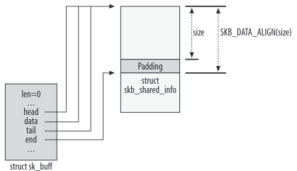

`(net)dev_alloc_skb` is the buffer allocation function meant for use by device drivers and expected to be executed in interrupt mode. It is simply a wrapper around `alloc_skb` that adds 16 bytes to the requested size for optimization reasons and asks for an atomic operation (`GFP_ATOMIC`) since it will be called from within an interrupt handler routine.

__Freeing memory: `kfree_skb` and `dev_kfree_skb`__

Returns a buffer to the pool. 

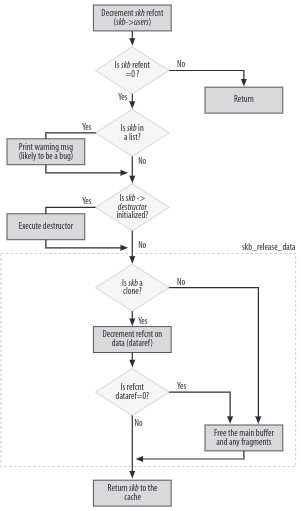

__Data reservation and aligment: `skb_reserve`, `skb_put`, `skb_push`, and `skb_pull`__

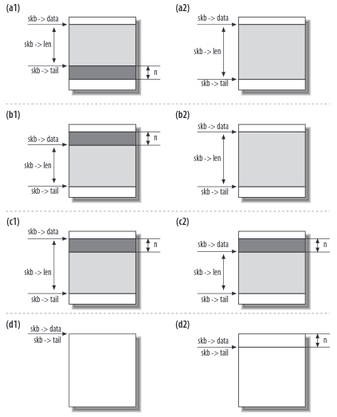

* (a) `skb_put`, (b) `skb_push`, (c) `skb_pull`, (d) `skb_reserve`

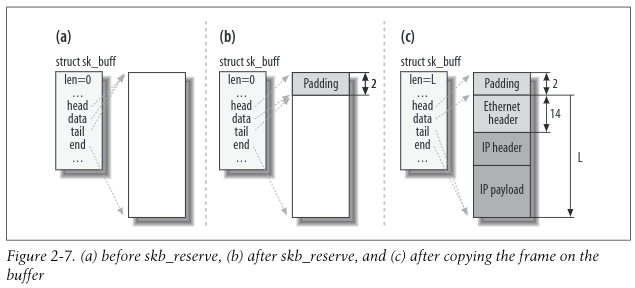

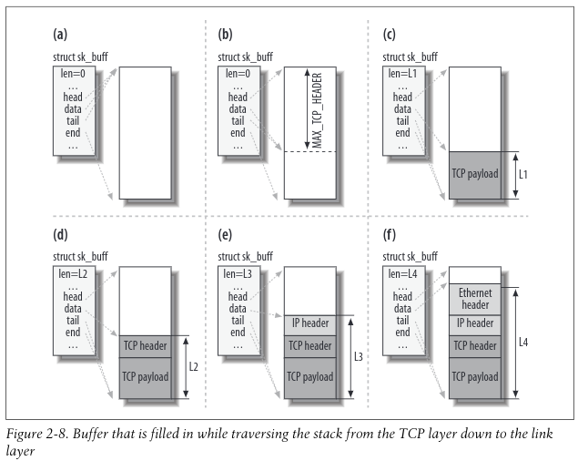

1. When TCP is asked to transmit some data, it allocates a buffer following certain criteria (TCP Maximum Segment Size (mss), support for scatter gather I/O, etc.).
2. TCP reserves (with `skb_reserve`) enough space at the head of the buffer to hold all the headers of all layers (TCP, IP, link layer). The parameter MAX_TCP_HEADER is the sum of all headers of all levels and is calculated taking into account the worst-case scenarios: because the TCP layer does not know what type of interface will be used for the transmission, it reserves the biggest possible header foreach layer. It even accounts for the possibility of multiple IP headers (because you can have multiple IP headers when the kernel is compiled with support for IP over IP
3. The TCP payload is copied into the buffer. The TCP payload could be organized differently; for example, it could be stored as fragments. 
4. The TCP layer adds its header
5. The TCP layer hands the buffer to the IP layer, which adds its header as well.
6. The IP layer hands the IP packet to the neighboring layer, which adds the link layer header.

__The `skb_shared_info` structure and the `skb_shinfo` function__

To keep additional information about the data block:

```c
struct skb_shared_info {
  atomic_t dataref; // #users
  unsigned int nr_frags; //#for IP
  unsigned short tso_size; // NIC card compute checksum
  unsigned short tso_seqs;
  struct sk_buff *frag_list; //#for IP
  skb_frag_t frags[MAX_SKB_FRAGS]; //#for IP
};
```

```c
#define skb_shinfo(SKB)((struct skb_shared_info *)((SKB)->end))
```

__Cloning and copying buffers__

When the same buffer needs to be processed independently by different consumers, and they may need to change the content of the `sk_buff` descriptor (the `h` and `nh` pointers to the protocol headers), the kernel does not need to make a complete copyof both the `sk_buff` structure and the associated data buffers. Instead, to be more efficient, the kernel can clone the original, which consists of making a copy of the `sk_buff` structure only and playing with the reference counts to avoid releasing the shared data block prematurely. Buffer cloning is done with the `skb_clone` function.

The `sk_buff` clone is not linked to any list and has no reference to the socket owner.The field `skb->cloned` is set to 1 in both the clone and the original buffer. `skb->users` is set to 1 in the clone so that the first attempt to remove it succeeds, and the number of references (`dataref`) to the buffer containing the data is incremented (since now there is one more `sk_buff` data structure pointing to it).

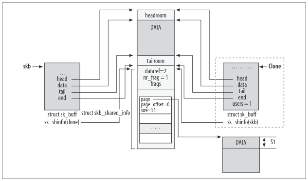

When a buffer is cloned, the contents of the data block cannot be modified. This means that code can access the data without any need for locking. When, however, a function needs to modify not only the contents of the `sk_buff` structure but the data too, it needs to clone the data block as well. In this case, the programmer has two options. When he knows he needs to modify only the contents of the data in the area between `skb->start` and `skb->end`, he can use `pskb_copy` to clone just that area. When
he thinks he may need to modify the content of the fragment data blocks too, he must use `skb_copy`.

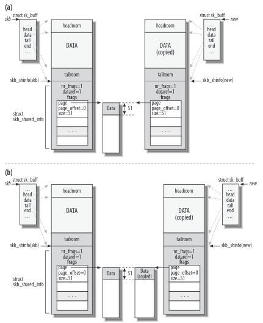

#### List management functions

List of `sk_buff` elements = queue

* `skb_queue_head_init`: init an `sk_buff_head` with an empty queue of elements 
* `skb_queue_head`, `sbk_queue_tail`: adds one buffer to the head or tail of a queue
* `skb_dequeue`, `skb_dequeue_tail`:  dequeues head or tail
* `skb_queue_purge`: empties queue
* `skb_queue_walk`: runs a loop

these functions must be executed atomically - thus are wrappers to a `__xxx` function with spinlock acquisition

### `net_device` structure

Used for all devices/interfaces, including real or virtual ones. The structures are in a list pointed by `dev_base`.

#### Identifiers

* `int ifindex`: unique ID, assigned to each device when registered with a call to `dev_new_index()`
* `int iflink`: used by (virtual) tunnel devices and identifies the real device to be used to reach the other end of the tunnel
* `unsigned short dev_id`: used by IPv6

##### Configuration

Some fields can be change at runtime (`ifconfig` or `ip`)

* `char name[IFNAMSIZ]`: name of the device ("eth0")
* `unsigned long mem_start` and `unsigned long mem_start`: fields to describe the shared memory used by the device to communicate with the kernem. Accessed only within the device driver.
* `unsigned long base_addr`: the beginning of the I/O memory mapped to the device's own memory
* `unsigned int irq`: interrupt number used by the device to talk to the kernel (can be shared). Allocated or freed with `request_irq()` and `free_irq`.
* `unsigned char if_port`: type of port being used for this interface.
* `unsigned char dma`: DMA channel used by the device (if any)
* `unsigned short flags`, `unsigned short gflags`, `unsigned short priv_flags`: represent capabilities or status (defined in `include/linux/if.h`)
* `int features`: another bitmap of flags. Report some communication abilities (with the CPU)
* `unsigned mtu`: MTU
* `unsigned short type`: category
* `unsigned short hard_header_len`: device header in octets.
* `unsigned char broadcast[MAX_ADDR_LEN]`: link layer broadcast addr
* `unsigned char dev_addr[MAX_ADDR_LEN]`, `unsigned char addr_len`: link layer address
* `int promiscuity`:

#### Interface types and ports

Devices with more than one connector and some port selection stuff

```c
switch (dev->if_port) {
	case IF_PORT_10BASE2:
		writeb((readb(addr) & 0xf8) | 1, addr);
		break;
	case IF_PORT_10BASET:
		writeb((readb(addr) & 0xf8), addr);            break;        
}
```

#### Promiscuous mode

See all frames that travel through a shared cable. The `promiscuity` counter informs on how many clients are using the mode. `dev_set_promiscuity()`

#### Statistics

`net_device` includes a pointer `priv` that is set by the driver to point to a structure storing information about the interface (*e.g.* number of RX or TX packets or number of errors).

Wireless devices use a different structure (`iw_statistics`)

#### Device status

To control interactions with the NIC, each device driver has to maintain information (*e.g* timestamps, flags) indicating what kind of behavior the interface requires. In a symmetric multiprocessing (SMP) system, the kernel also has to make sure that concurrent accesses to the same device from different CPUs are handled correctly. 

* `unsigned long state`: set of flags used by the networking queuing subsystem index in the enum `netdev_state_dev`
* `enum {...} reg_state`: registration state of the device
* `unsigned long trans_start`: time in jiffies when last transmission started. To reset the card in case a very loong delay.
* `unsigned long last_rx`: time in jiffies when last packet received
* `struct net_device *master`: protocols that regroup devices into one and elect a *master*
* `spinlock_t xmit_lock`, `int xmit_lock_owner`: `xmit_lock` is used to serialize accesses to the driver function `hard_start_xmit`. This means that each CPU can carry out only one transmission at a time on any given device. `xmit_lock_owner` is the ID of the CPU that holds the lock. It is always 0 on single-processor systems and –1 when the lock is not taken on SMP systems. It is possible to have lockless transmissions when the device driver supports it.
  
* `void *atalk_ptr`
* `void *ip_ptr`
* `void *dn_ptr`
* `void *ip6_ptr`
* `void *ec_ptr`
* `void *ax25_ptr`

These six fields are pointers to data structures specific to particular protocols, each data structure containing parameters that are used privately by that protocol. `ip_ptr`, for instance, points to a data structure of type `in_device` (eventhough it is declared as `void *`) that contains different IPv4-related parameters, among them the list of IP addresses configured on the interface.

#### List management

`net_device` DSs are inserted into a global list and into two hash tables, using these fields:

* `struct net_device *next`: next in the global list
* `struct hlist_node name_hlist` & `struct hlist_node index_hlist`: link the `net_device` structure to the bucket's list of two hash tables.

#### Link layer multicast

* `struct dev_mc_list *mc_list`: pointer to head of this device's list of `dev_mc_list` structures
* `int mc_count`: number of multicast addresses for this device (lenght of the list pointed by `mc_list`)
* `int allmulti`: when nonzero, causes the device to listen to all multicast addresses. Like `promiscuity`, discussed earlier in this chapter, `allmulti` is a reference count rather than a simple Boolean. This is because multiple facilities may independently require listening to all addresses. When the variable goes from 0 to nonzero, the function `dev_set_allmulti` is called to instruct the interface to listen to all multicast addresses. The opposite happens when `allmulti` goes to 0.

#### Traffic management

traffic control subsystem (TCS)

* `struct net_device *next_sched`: used by one of the software interrupt
* `struct Qdisc *qdisc`
* `struct Qdisc *qdisc_sleeping`
* `struct Qdisc *qdisc_ingree`
* `struct list_head qdisc_list`: these fields are used to manage the ingree and egress packet queues and access to the device from different CPUs

* `spinlock_t queue_lock`
* `spinlock_t ingress_lock`: the TCS defines a private egress queue for each network device, and thus a lock associated to it.
  
* `unsigned long tx_queue_len`: the length of the device's transmission queue. When TCS is present in the kernel, the value may not be used

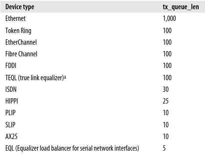
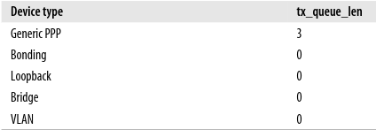

#### Feature specific

* `struct divert_blk *divert`: __diverter__ is a feature that allows you to change the source and destination addresses of the incoming packet. This makes it possible to reroute traffic with specific characteristics specified by the configuration to a different interface or adifferent host. To work properly and to make sense, diverter needs other features such as bridging. The data structure pointed to by this field stores the parameters needed by the diverter feature.
* `struct net_bridge_port *br_port`: extra information needed when the device is configured as a bridged port
  
* `void (*vlan_rx_register)(...)`
* `void (*vlan_rx_add_vid)(...)`
* `void (*vlan_rx_kill_vid)(...)`: these three function pointers are used by the VLAN code to register a device as VLAN tagging capable, add a VLAN to the device, and delete the VLAN from the device
  
* `int netpoll_rx`
* `void (*poll_controller)(...)`: used by the optional Netpoll feature...

#### Generic

* `atomic refcnt`: reference count (if != 0, device cannot be unregistered)
  
* `int watchdog_timeo`
* `struct timer_list watchdog_timer`: timer related
  
* `int (*poll)(...)`
* `struct list_head_poll_list`
* `int quota`
* `int weight`: used by NAPI
  
* `const struct iw_handler_def *wireless_handlers`
* `struct iw_public_data *wireless_data`: stuff used by wireless devices
  
* `struct list_head todo_list`: to handle device unregistration
* `struct class_device class_dev`: used by new generic kernel infrastructure

#### Function pointers

- transmit and receive a frame
- add or parse the link layer header on a buffer
- change a part of the configuration
- retrieve statistics
- interact with a specific feature

* `struct ethtool_ops *ethtool_ops`: pointer to a set of function pointers used to set or get the configuration of different device parameters
  
* `int (*init)(...)`
* `void (*uinit)(...)`
* `void (*destructor)(...)`
* `int (*open)(...)`
* `int (*stop)(..)`: used to initialize, clean up, destroy, enable, and disable a device. Not all of them are always used.
  
* `struct net_device_stats* (*get_stats)(...)`
* `struct iw_statistics* (*get_wireless_stats)(...)`: some statistics collected by the device driver can be displayed with user-space applications such as `ifconfig` and `ip`, and others are strictly used by the kernel. These two methods are used to collect statistics. `get_stats` operates on a normal device and `get_wireless_stats` on a wireless device.
  
* `int (*hard_start_xmit)(...)`: transmit a frame
  
* `int (*hard_header)(...)`
* `int (*rebuild_header)(...)`
* `int (*hard_header_cache)(...)`
* `void (*header_cache_update)(...)`
* `int (*hard_header_parse)(...)`
* `int (*neigh_setup)(...)`: Used by the neighboring layer

* `int (*do_ioctl)(...)`: syscall to issue command to devices
* `void (*set_multicast_list)(...)`: this method is used to ask the device driver to configure the device to listen to multicast addresses. Usually it is not called directly, but through wrappers such as `dev_mc_upload` or its lockless version, `__dev_mc_upload`. When a device cannot install a list of multi-cast addresses, it simply enables all of them.
* `int (*set_mac_address)(...)`: changes the MAC address
* `int (*set_config)(...)`: Configures driver parameters, such as the hardware parameters `irq`, `io_addr`, and `if_port`. Higher-layer parameters (such as protocol addresses) are handled by `do_ioctl`.
* `int (*change_mtu)(...)`: change the MTU
* `void (*tx_timeout)(...)`: The method invoked at the expiration of the watchdog timer, which determines whether a transmission is taking a suspiciously long time to complete. The watchdog timer is not even started unless this method is defined.
* `int (*accept_fastpath)(...)`: fast switching (also called FASTROUTE) was a kernel feature that allowed device drivers to route incoming traffic during interrupt context using a small cache (bypassing all the software layers). Fast switching is no longer supported, starting with the 2.6.8 kernel. This method was used to test whether the fast-switching feature could be used on the device

#### Files mentioned

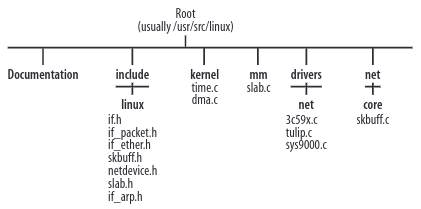

 


